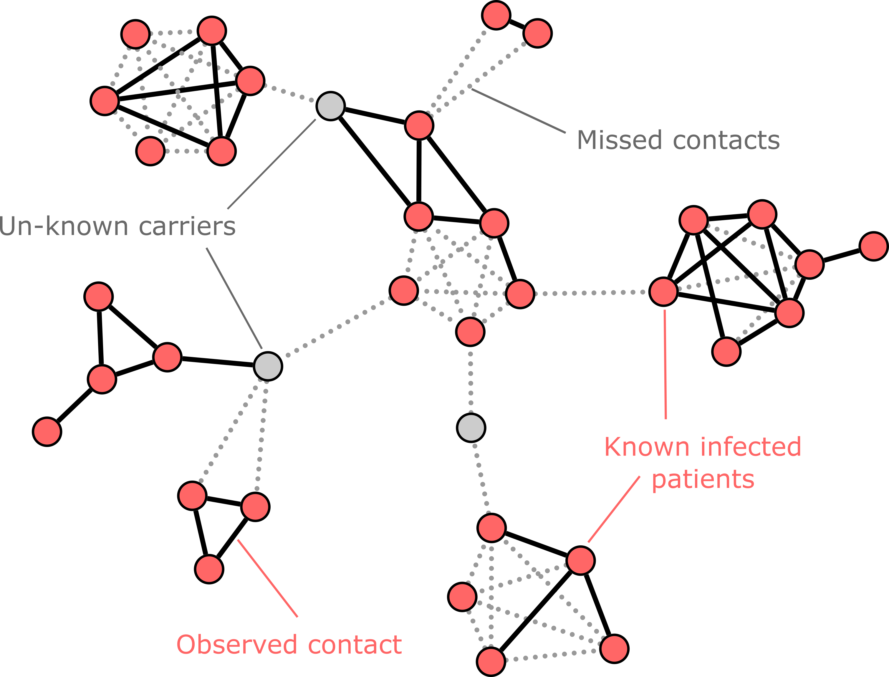
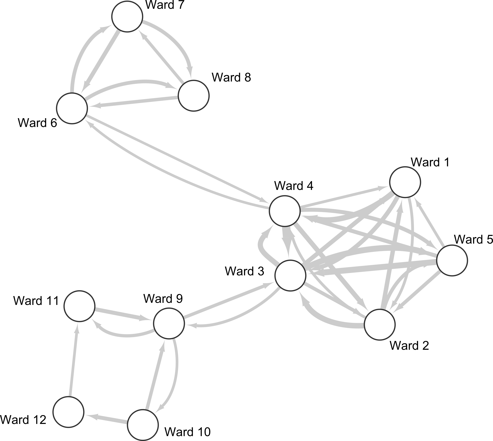
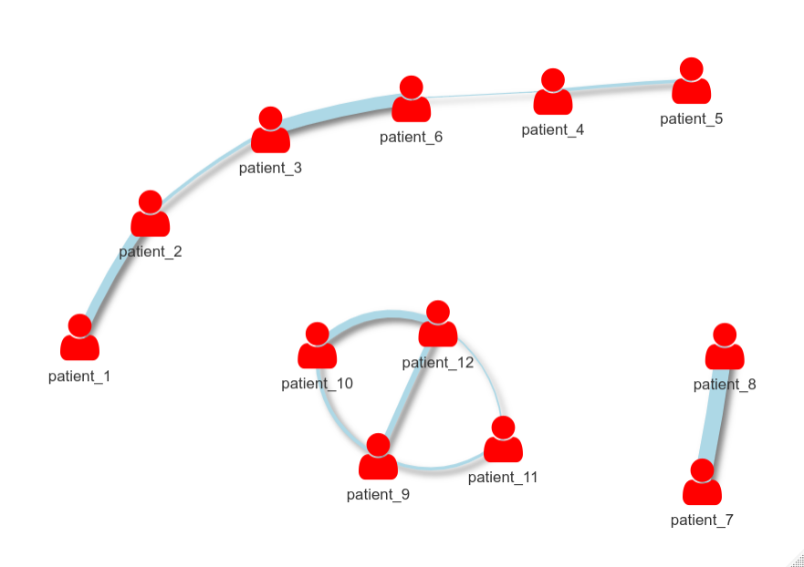

# Characterising contact in disease outbreaks via a network model of spatial-temporal proximity

## Paper overview

We introduce a novel contact model which recovers undetected transmission of infectious disease (*Myall et. al 2021*). Outbreaks of disease are both burdensome and extremely common. Contact tracing based on direct contacts is often used in disease outbreaks to prevent further spread. However, missing and indirect contacts pose severely limit contact tracing and result in misleading conclusions. 

<p align="center">
  
</p>

<sub>*Traditional contact tracing based on direct contact, a widely used tool in disease outbreak investigations, can be hampered by missing data. Both non-observable contacts between infected individuals or unknown infected individuals serving as links between infected patients can result in misleading and limited results. Moreover, transmission facilitated through environmental surfaces or staff can all form an abundance of indirect and non-observable links.*</sub>

Here, we propose a Spatial-temporal Epidemiological Proximity (StEP) model, based on graph theory, to mitigate these problems by measuring proximity between network-constrained temporal trajectories across background movement patterns. Our model naturally captures already known, but also missed contact likely to have resulted in transmission. 

<p align="center">
  
</p>

<sub>*Model overview. Firstly, patient movement histories are captured as a set of network trajectories passing through nodes of a background movement graph D (Panel A). Typically, only direct contact is considered when determine transmission from infected patient movement, however, this inherently missed indirect contact which can also be a source of disease transmission. Our model recovers both indirect and direct contact by measuring points between trajectories in terms of the spatial proximity delta (network-wise) and temporal proximity tau (Panel B). This spatial-temporal proximity allows us to quantifies how close patients have into a mathematical object (a patient trajectory similarity matrix) S (Panel C). Given disease portability of disease transmission increases the longer patients coincide, we recover the contact leading to transmission by forming a contact graph S hat by looking for strongest contact patterns (weighted by proximity) in S (Panel D).*</sub>

In our preprint (*Myall et. al 2021*) we showcased StEP's ability to capture transmission routes in outbreaks of healthcare-acquired infections between hospital patients and demonstrated its efficacy with a partnered genomic analysis. Using a semi-supervised learning framework and bio-markers obtained from Whole Genome Sequencing, we showed that our model reveals missing patient interactions that improve disease transmission characterisation.


## Repo overview

This repo provides an implementable example of the model proposed in *Myall et al. 2021.*  `R/` is the folder for scripts that contain R functions. All functions are documented with [roxygen2](https://roxygen2.r-lib.org/) syntax.

### Example data

There are 2 datasets required for StEP. Firstly, is the total mobility patterns over which spatial-temporal contact is measured. Secondly are the trajectories of infected individuals under investigation.

Total mobility patterns capture how diseases will spread since individuals and their person-person are a primary vector in transmission. Routes of disease spread are often dominated by a set of most probable trajectories (*Brockmann and Helbing 2013*). However, as we previously showed, heterogeneous structure existed amongst movements patterns (*Myall et al. 2020*). Probable trajectories then must be derived based on mobility which captures general patterns of movement. Specifically, we capture these most probable trajectories, `D`, which contains the shortest paths between location nodes in terms of effective distance (Brockmann and Helbing 2013). Here we can call the function `eff_dist()`, which computes matrix `D` when provided a data frame containing the weighted directed edges of total mobility patterns.

```R
D = eff_dist(read_csv("data/background_movement.csv")) 
```

The dataset `data/background_movement.csv` is a simple example with 12 locations (wards) which the subsequent `trajectories` are recorded over:

<p align="center">
  
</p>


<sub>*Network visualisation of example background mobility data*</sub>

The function `example_trajectories()` generates a long dataframe with 12 pre-set trajectories. Each trajectory is a series of locations (rows in the dataframe) with both a location (wards in our paper and example, but are network nodes) and a time component. For later computation, we also split the `trajectories` dataframe into a list of dataframes `traj.l` based on the `trajectories$patient.ID` column.


```R
trajectories = example_trajectories()

traj.l <- split(trajectories , f = trajectories$patient.ID)
```

### Computing proximity between trajectories

The function `getSpatialTempProx()` computes total spatial-temporal proximities using our kernel function and returns a weighted undirected dataframe of `edges`. We measure spatial-temporal proximity between ward-time locations for every pair of individuals using our spatial-temporal distance kernel found in *Myall et al. 2021.*. The parameter beta represents a propagation speed across background movement and is specific to the pathogen under study.


```R
edges = getSpatialTempProx(traj.l,   # list of trajectories
                 D,                  # efffective distance matrix 
                 beta = 0.6)         # paramter for speed of propergation
```
For more individuals or larger pathways the computation will take increasingly longer:

```
[1] "Computing proximities"
  |=============================================================================================           |  89%
```

### Graph construction with Continuous *k*-nearest neighbors (Cknn)

Incorporating graph structure between data points can aid classification through the emphasis of strong relationships. Hence, to reveal stronger contacts capturing transmission, we remove weak connections by sparsifying the corresponding fully connected graph made from the `edges` in `getSpatialTempProx()`. 

Although several alternative graph construction methods exist, we focus on Continuous *k*-nearest neighbors (Cknn) an extension to *k*-nearest neighbors (Berry and Timothy 2016). Implemented in the function `cknneighbors_graph`, it takes provide the fully connected `edges`, the paramter `k` for number of nearest neighbors to include, and an optinal paramter `lambda` (set by defaut to `lambda=1` if not provided), and returns a sparsified edges `edges_cknn` according to the Cknn algorithm.

```R
edges_cknn = cknneighbors_graph(k=3,             # parameter for k-nearest neighbors
                                #lambda = 1,     # data point density
                                edges = edges)   # fully connected edges
```


### Visualising final contact network

```R
# Preprocess data
netDat = preproNet(trajectories,edges_cknn)

# Visualise network
visNetwork(nodes = netDat$nodes,edges = netDat$edges)
```
<p align="center">
  
</p>


## References

<div id="refs" class="references">

<div id="ref-brockmann_2013">

Brockmann, Dirk, and Helbing, Dirk. 2013. “The hidden geometry of complex, network-driven contagion phenomena.” science 342.6164 (2013): 1337-1342. https://science.sciencemag.org/content/342/6164/1337

</div>

<div id="ref-myall_2021">

Myall, Ashleigh and Peach, Robert and Wan, Yu and Mookerjee,Siddharth and Jauneikaite, Elita and Bolt, Frankie and Price, James and Davies, Frances and Wiesse, Andrea and Holmes, Alison and Barahona, Mauricio. 2021. "Characterising contact in disease outbreaks via a network model of spatial-temporal proximity." medRxiv preprint. https://doi.org/10.1101/2021.04.07.21254497

</div>


<div id="ref-myall_2020">

Myall, Ashleigh and Peach, Robert and Weiße, Andrea and Davies, Frances and Mookerjee, Siddharth and Holmes, Alison and Barahona, Mauricio. 2020. "Network memory in the movement of hospital patients carrying antimicrobial-resistant bacteria." arXiv preprint. https://arxiv.org/abs/2009.14480v2

</div>


<div id="ref-myall_2020">

Berry, Tyrus, and Timothy Sauer. 2016. "Consistent manifold representation for topological data analysis." Foundations of Data Science. http://aimsciences.org//article/id/2556e6c9-b4b9-455a-9d9e-886ef0cd166f

</div>
